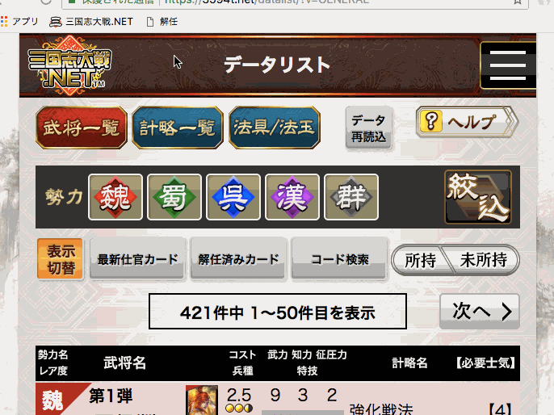

### このツールについて

[三国志大戦.NET](https://3594t.net) で解任したカードを [三国志大戦 桃園の解任ページ](https://3594t-touen.jp/recruitments) へ投稿するのを支援するブックマークレットです。

### 注意

- 本ツールは個人が作成した非公式のツールです。
- 本ツールの使用により発生したトラブル、不利益については一切の責任を負いかねます。
- 本ツールについてや本ツール使用時による不具合を 三国志大戦公式サイトの運営元である 株式会社セガ・インタラクティブ へ行うのは絶対にやめて下さい。
- 各サイトの仕様変更により使えなくなる可能性があります。
- 不具合については [Github issues](https://github.com/boushi-bird/3594t-discard-bookmarklet/issues) か [こちら](https://3594t-touen.jp/posts/51162) にお願いします。
- 以上のことを理解した上で自己責任のもとでお使い下さい。

### ブックマークレットの登録

[bookmarklet/main.js](bookmarklet/main.js) 

{::nomarkdown}
<iframe src="bookmarklet/main.js" style="width: 100%;"></iframe>
{:/nomarkdown}

1. 上記枠内の内容を全部選択しコピーする。  
2. ブラウザのブックマークに登録する。
  * 登録方法は `ブックマークレット 登録方法 (お使いのWebブラウザ名)` で調べてみて下さい。

### 使い方

1. [三国志大戦.NET](https://3594t.net) 、 [三国志大戦 桃園](https://3594t-touen.jp) どちらもあらかじめログインを済ませる。
2. [三国志大戦.NET データリスト](https://3594t.net/datalist/) を開く。
3. ブックマークレットを実行する
4. 解任した武将カード一覧が表示されるので投稿する武将にチェックを付ける。
5. "選択した武将をコピーする" ボタンをクリックすると選択された武将カードがクリップボードへコピーされる
6. "解任新規作成へ" リンクをクリックすると[三国志大戦 桃園の解任ページ](https://3594t-touen.jp/recruitments)の投稿画面が開かれる。
7. コピーされた内容を本文に貼り付けして タイトルをつけ、内容が間違いないことを確認してから投稿する。

### Google Analytics ついて

このページはアクセス状況確認のため、Google Analytics を使用して
使用されているブラウザ・OSなどの情報を取得しています。
Google Analytics はその解析のために Webブラウザの Cookieを使用しています。
収集するデータは匿名のもので個人を特定するものではありません。
詳しくは[こちら](https://policies.google.com/technologies/partner-sites?hl=ja)をご確認ください。

なお、ブックマークレット本体のほうでは Google Analytics は使用しておらず、
一切の情報を取得しておりませんので安心してお使い下さい。
